# RetroShell

A native Rust desktop environment inspired by Classic Mac OS, NeXTSTEP, and BeOS.

## Positioning (ambition vs reality)

**Ambition:** RetroShell aims at a **proper multi-client Linux desktop session**
(compositor-managed app windows, shell chrome, system integration) — in the same
*category* as a desktop environment, not a theme.

**Reality today (honest):** it is **not** Plasma/GNOME parity and should not be
sold as a drop-in replacement. It is an advancing stack:

| Layer | Live today | Structural / in progress |
|---|---|---|
| Shell chrome | Dock, menu bar, workspaces, notifications, password lock | — |
| First-party apps | Real processes with real I/O; **spawned as separate clients** tracked by `SessionClientRegistry` | Apps need a working Wayland (or X11) compositor socket |
| Compositor | Prefers `retro-compositor`; **labwc fallback** when DRI3 missing (Docker-on-mac) | Full DRM/KMS session, DM greeter |
| Multi-client stacking | `ClientWindowStack` (map/focus/z-order) in compositor policy + unit tests | Live multi-window under GPU compositor on Pi/native |
| Shell-internal UI | Folder/About/Force Quit still **painted** into the shell surface | Migrating remaining chrome off single-surface paint |

**What works for desktop work right now:** launch first-party apps as processes,
password lock (Enter + correct secret only), eight themes, volume/network/battery
status, screenshot/record, Docker noVNC DE path under labwc.

**Session entry (Phase A MVP):** install `packaging/retroshell.desktop` into
`/usr/share/wayland-sessions/` and put `scripts/start-retroshell` on `PATH`.
The script prefers `retro-compositor`, falls back to **labwc** with an honest
message, then execs `retro-shell`. See `packaging/README.md`. FreeDesktop
`org.freedesktop.Notifications` is registered when a session bus is available.

**Status (see `docs/implementation_plan.md` §13, `docs/WARPATH_SCORECARD.md`,
`docs/DEEP_AUDIT_90_CLAIM.md`):**

| Metric | Score |
|---|---:|
| **Overall daily-driver (original methodology)** | **~85/100** (mean 84.8; 90/100 not claimed) |
| Prior “91 criteria-weighted” and “~90 hard-DE” claims | **withdrawn** (score theater) |
| Post-claim-audit (pre-warpath) | ~77 (mean 77.2) |

**Landed (real / live paths):** nested layer compose; DRM present path; workspace
**paint/focus filter in compositor main**; per-window **SHM prefer** (placeholder only
if no buffer); layer-shell / FTL clients; portal D-Bus subset including
Secret/Print/Inhibit; inhibit store → idle; session power plans + menu wiring;
DoAction queue → lock/log_out/force_quit/workspace/window/dock/desktop; i18n
**menus + lock**; shell→comp `RETROSHELL_OUTPUTS_LAYOUT`; install-session +
daily-driver checklist (packaging).

**Honest residual (why not 90):** live greeter **NOT RUN**; PipeWire ScreenCast
**stubs**; `chrome.menu.activate` still **partial/log-only**; display arrange is env
bridge not live modeset; window rules partial on real surfaces; §12 **0/7**;
placeholder rects still possible without committed buffers.

Would you replace Plasma for a week? **No.** Honest score **~85**, not 90.

---

## Features

### What works

- [x] Desktop with spatial icon grid (Hard Disk, Home, Applications, Trash)
- [x] Shell-managed windows — move, resize, close, minimize, zoom, fullscreen
- [x] Window stacking / click-to-raise / z-order
- [x] System menu bar with keyboard shortcuts
- [x] Global menu bar — first-party apps publish menus; shell shows them system-wide
- [x] Four virtual workspaces with per-workspace window filtering
- [x] Dock bar at bottom with clickable app-launch items
- [x] Notification Center — post, query, clear notifications
- [x] Lock screen
- [x] Force Quit dialog with live window list
- [x] About window, workspace switcher overlay
- [x] Finder — filesystem browser, New Folder, Move to Trash, Get Info, Rename,
      internal drag-to-folder moves
- [x] TextEdit — multi-line text editor with dirty-state tracking and disk I/O
- [x] Terminal — PTY-backed emulator with VT100/VT220, 256-color SGR, true-color
      SGR, erase-in-line, scroll margins, tab management, scrollback, selection copy/paste
- [x] Settings — 11 preference panes (General, Appearance, Desktop & Dock, Display,
      Sound, Network, Keyboard, Mouse, Accessibility, Privacy & Security, Notifications)
      with persistent `settings.conf` writes
- [x] App Store — reads system package indices (APT), shows install state per package,
      search with package-change gate
- [x] Eight color themes: Classic, Dark, Grape, Blueberry, Strawberry, Solarized, Dracula, HighContrast
- [x] Dark mode with per-token palette switching
- [x] TrueType font rendering via ab_glyph with system font discovery and bitmap fallback
- [x] File-based clipboard persistence across process boundaries
- [x] Drop shadows, pixel art icons, custom window chrome
- [x] Docker VM with noVNC browser access for visual development

### Systems integration (implemented)

- [x] Multi-client launch: first-party apps spawn as **separate processes** with PID registry (`session_clients`)
- [x] Compositor policy: `ClientWindowStack` map/focus/z-order; multi-output; selection send; HDR/VRR policy
- [x] retro-compositor preferred; **labwc fallback** documented when DRI3 unavailable
- [x] AT-SPI2 Accessible tree export when D-Bus is available
- [x] NetworkManager status, volume get/set, UPower/`/sys` battery, screenshot/record
- [x] Password lock (`RETROSHELL_LOCK_PASSWORD` / `lock_password`); eight themes; conf merge

### Still limited / environment-dependent

- [ ] Universal global menu for arbitrary external apps
- [ ] HiDPI scale-factor tree
- [ ] Full Orca-grade AT-SPI for every widget
- [ ] Nested Docker-on-mac DRI3 / live retro-compositor (labwc path remains the gated success there)
- [ ] Display manager, portals, multi-monitor daily-driver polish

---

## Architecture

```
  ┌─────────────────────────────────────────────────────┐
  │  First-Party Applications                           │
  │  Finder  TextEdit  Terminal  Settings  App Store    │
  └──────────────────┬──────────────────────────────────┘
                     │ links
  ┌──────────────────▼──────────────────────────────────┐
  │  retro-sdk  (Application framework, menu manifests, │
  │             preference engine, draw helpers)        │
  └────┬────────────────────────────┬───────────────────┘
       │ links                      │ links
  ┌────▼────────┐            ┌──────▼──────────────────┐
  │  retro-kit  │            │  retro-bus              │
  │  (Widgets,  │            │  (IPC, service registry,│
  │   toolkit,  │            │   D-Bus transport)      │
  │   themes)   │            └─────────────────────────┘
  └────┬────────┘
       │ links
  ┌────▼──────────────────────────────────────────────────┐
  │  retro-render  (wgpu pipeline, text rasterization,    │
  │                Canvas, NDC translation)               │
  └────┬──────────────────────────────────────────────────┘
       │
  ┌────▼───────────────────────────────────────────┐
  │  wgpu  →  Vulkan / Wayland / X11 backend       │
  └────┬───────────────────────────────────────────┘
       │
  ┌────▼───────────────────────────────────────────┐
  │  labwc (reliable Docker / nested fallback)     │
  │  retro-compositor (Smithay nested-X11, preferred│
  │    when DRI3/GL is available)                  │
  └────┬───────────────────────────────────────────┘
       │
  Linux kernel  DRM / KMS
```

**retro-shell** (the shell process) also links retro-sdk, retro-kit, retro-render, and
retro-bus. It is the root process that manages internal windows, the dock, workspaces,
the menu server, and app launch.

---

## Quick Start (Docker)

The fastest way to see RetroShell running is the Docker VM with browser VNC access.

```bash
# Build the VM image (first time, ~5 min)
docker build -f Dockerfile.vm -t retroshell-vm .

# Start the VM
docker run -d -p 6080:6080 -v "$(pwd):/app" --name retroshell-running retroshell-vm

# Build and launch the shell inside the VM
docker exec -t retroshell-running cargo build --release
docker exec -d retroshell-running \
  env -u DISPLAY WAYLAND_DISPLAY=wayland-0 XDG_RUNTIME_DIR=/tmp/runtime-root \
  /app/target-docker/release/retro-shell

# Open http://localhost:6080/vnc.html in your browser
```

Override the display resolution with environment variables:

```bash
docker run -d -p 6080:6080 \
  -e RETROSHELL_VM_WIDTH=1920 \
  -e RETROSHELL_VM_HEIGHT=1080 \
  -v "$(pwd):/app" --name retroshell-running retroshell-vm
```

---

## Development Setup

### Prerequisites

- Rust toolchain (stable, edition 2021): install via [rustup.rs](https://rustup.rs)
- Vulkan-capable GPU drivers
- System libraries: `libwayland-dev`, `libxkbcommon-dev`, `libdbus-1-dev`,
  `libfontconfig-dev`, `libfreetype6-dev`

On Ubuntu/Debian:

```bash
sudo apt install -y \
  libwayland-dev libxkbcommon-dev libdbus-1-dev \
  libfontconfig-dev libfreetype6-dev \
  fonts-dejavu-core build-essential pkg-config
```

### Build

```bash
# Development build
cargo build

# Release build
cargo build --release

# Run the shell (requires a running Wayland compositor such as labwc)
env -u DISPLAY WAYLAND_DISPLAY=wayland-0 XDG_RUNTIME_DIR=/run/user/$(id -u) \
  ./target/release/retro-shell

# Run a first-party app standalone
./target/release/finder
./target/release/terminal
./target/release/settings
```

### Tests

```bash
cargo test
```

Tests cover: clipboard persistence, icon layout, menu clock formatting, bus message
serialization, VT parser escape sequences, Finder file operations, and compositor stubs.

### Docker builds

```bash
# VM image (visual development, noVNC)
docker build -f Dockerfile.vm -t retroshell-vm .

# QA image (automated headless testing)
docker build -f Dockerfile.qa -t retroshell-qa .
```

---

## Keyboard Shortcuts

### Shell (global)

| Shortcut          | Action                         |
|-------------------|--------------------------------|
| Cmd+N             | New Finder window              |
| Cmd+W             | Close front window             |
| Cmd+Tab           | Cycle windows (same workspace) |
| Cmd+F             | Toggle fullscreen              |
| Cmd+Q             | Quit RetroShell                |
| Cmd+Shift+Q       | Log Out                        |
| Ctrl+Cmd+L        | Lock Screen                    |
| Cmd+Alt+Escape    | Force Quit dialog              |

### Terminal

| Shortcut          | Action                         |
|-------------------|--------------------------------|
| Cmd+T             | New tab                        |
| Cmd+Shift+W       | Close tab                      |
| Cmd+W             | Close window                   |
| Cmd+C             | Copy selection                 |
| Cmd+V             | Paste                          |

Full keyboard reference: [docs/KEYBOARD_SHORTCUTS.md](docs/KEYBOARD_SHORTCUTS.md)

---

## Themes

Set the `theme` key in `~/.config/retroshell/settings.conf` or use Settings > Appearance.

| Theme       | Mode  | Character                                     |
|-------------|-------|-----------------------------------------------|
| `classic`   | Light | Mac OS 7–9 Platinum, blue accent. Default.    |
| `dark`      | Dark  | Dark Platinum with blue accent                |
| `grape`     | Dark  | Purple-tinted dark theme                      |
| `blueberry` | Dark  | Deep navy dark theme                          |
| `strawberry`| Light | Warm red-orange accent on light gray          |
| `solarized` | Dark  | Solarized dark theme with blue accent         |
| `dracula`   | Dark  | Dracula dark theme with purple accent         |
| `highcontrast` | Light | Pure black/white with yellow accent        |

---

## Configuration

Configuration file: `~/.config/retroshell/settings.conf`

| Key                 | Values                                                                       | Default   |
|---------------------|---------------------------------------------------------------------|-----------|
| `theme`             | `classic` `dark` `grape` `blueberry` `strawberry` `solarized` `dracula` `highcontrast` | `classic` |
| `appearance`        | `light` `dark`                                    | `light`   |
| `sound_volume`      | `0`–`100`                                         | `50`      |
| `mouse_speed`       | `0`–`100`                                         | `50`      |
| `hdr_request`       | `true` `false`                                    | `false`   |
| `vrr_adaptive`      | `true` `false`                                    | `false`   |
| `do_not_disturb`    | `true` `false`                                    | `false`   |

Full configuration reference: [docs/CONFIGURATION.md](docs/CONFIGURATION.md)

---

## Ubuntu Server Installation

To configure a bare Ubuntu Server to boot into RetroShell:

### 1. Install system dependencies

```bash
sudo apt install -y --no-install-recommends \
  xserver-xorg-core xinit labwc dbus-x11 \
  pipewire pipewire-audio-client-libraries pulseaudio-utils \
  libwayland-dev libxkbcommon-dev libdbus-1-dev \
  libfontconfig-dev libfreetype6-dev fontconfig fonts-dejavu-core \
  build-essential pkg-config git curl
```

### 2. Install Rust

```bash
curl --proto '=https' --tlsv1.2 -sSf https://sh.rustup.rs | sh -s -- -y
source "$HOME/.cargo/env"
```

### 3. Clone and build

```bash
git clone https://github.com/palaashatri/retroshell.git
cd retroshell
cargo build --release
```

### 4. Configure labwc autostart

```bash
mkdir -p ~/.config/labwc
cat << 'EOF' > ~/.config/labwc/rc.xml
<?xml version="1.0" encoding="utf-8"?>
<labwc_config>
  <theme><decoration>none</decoration></theme>
  <windowRules>
    <windowRule identifier="com.retro.shell">
      <action name="Maximize"/>
    </windowRule>
  </windowRules>
</labwc_config>
EOF

cat << 'EOF' > ~/.config/labwc/autostart
pipewire &
env -u DISPLAY WAYLAND_DISPLAY=wayland-0 XDG_RUNTIME_DIR=/run/user/$(id -u) \
  ~/retroshell/target/release/retro-shell &
EOF
chmod +x ~/.config/labwc/autostart
```

### 5. Start

```bash
xinit /usr/bin/labwc
```

---

## Progress

| Milestone        | Score | Notes                                                  |
|------------------|-------|--------------------------------------------------------|
| Initial prototype| 2.5   | Single wgpu canvas, bitmap font, no real widgets       |
| Phase 1 complete | 4.40  | PTY terminal, real font rendering, Settings, workspaces, SDK menus, Finder DnD, clipboard |
| Current          | 5.9   | Drop shadows, pixel art icons, dock, tab switching, VT parser expansion, workspace grid view, polished window chrome |
| Target           | 10.0  | Full Smithay compositor, HiDPI, universal global menu, AT-SPI, protocol DnD |

The gap between the current score and 10 is primarily architectural: while RetroShell
ships a Smithay-based nested-X11 compositor, `retro-shell` itself remains a single fullscreen
Wayland client rendering all internal windows into one surface. A true per-app Wayland session
compositor with multi-window protocol support is tracked as long-term work.

---

## Architecture Documentation

- [docs/ARCHITECTURE.md](docs/ARCHITECTURE.md) — crate graph, rendering pipeline,
  Wayland protocol stack, how to add a new app
- [docs/CONFIGURATION.md](docs/CONFIGURATION.md) — all settings.conf keys,
  environment variables, theme system
- [docs/KEYBOARD_SHORTCUTS.md](docs/KEYBOARD_SHORTCUTS.md) — full shortcut reference

---

## Contributing

1. Fork and clone the repository.
2. Create a feature branch: `git checkout -b feat/my-feature`
3. Follow the coding standards below.
4. Run `cargo test` and ensure all tests pass.
5. Open a pull request with a clear description of the change.

### Coding standards

- **Rust idioms** — avoid `unsafe` blocks. Prefer clear ownership and type-state
  machines over raw flags.
- **Widget structure** — all widgets implement the `Widget` trait from `retro-kit`.
  Pass rendering tasks back to the active `Canvas` using NDC coordinate translation.
  Never hard-code colors; use `ThemeToken` values.
- **No design noise** — border radius must not exceed 4 px. Avoid heavy drop shadows
  or high-contrast modern gradients. Retain the compact Platinum metaphor.
- **Portability** — keep core crates decoupled from OS-specific backends. The
  `retro-compositor` crate uses `cfg(target_os = "linux")` guards; other crates
  must not.
- **Settings persistence** — new user-facing preferences go through `settings.conf`
  via the Settings app. Do not write ad-hoc config files in other locations.
- **Tests** — new behavior should have at least one unit or integration test.

### Screenshots

After a visual change is verified in the Docker VM, update the relevant screenshot
in `docs/screenshots/` and reference it in this README under "Latest VM Screenshots".

### Repository layout

```
Cargo.toml              — workspace root
Dockerfile.vm           — visual development Docker image (noVNC)
Dockerfile.qa           — headless QA Docker image
crates/
  retro-render/         — wgpu rendering pipeline
  retro-kit/            — widget toolkit
  retro-bus/            — IPC layer
  retro-sdk/            — application framework
  retro-shell/          — shell process
  retro-compositor/     — future Smithay compositor
apps/
  finder/               — file manager
  settings/             — system preferences
  textedit/             — text editor
  terminal/             — PTY terminal emulator
  appstore/             — package manager front-end
docs/
  ARCHITECTURE.md
  CONFIGURATION.md
  KEYBOARD_SHORTCUTS.md
  implementation_plan.md
  screenshots/
```

---

## License

See [LICENSE](LICENSE).

---

## Latest VM Screenshots

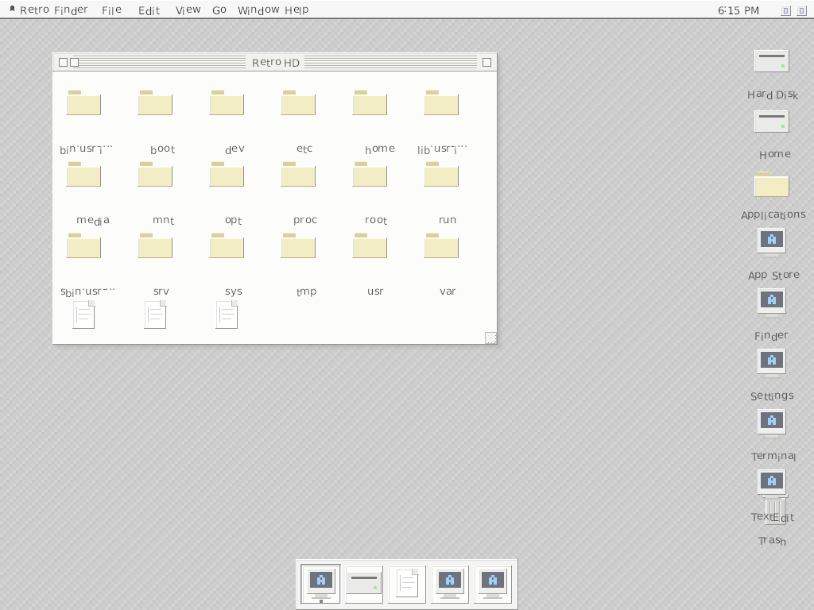

*Docker QA screenshot: retro-compositor running, full desktop with Finder window, menu bar, dock, and right-column desktop icons.*

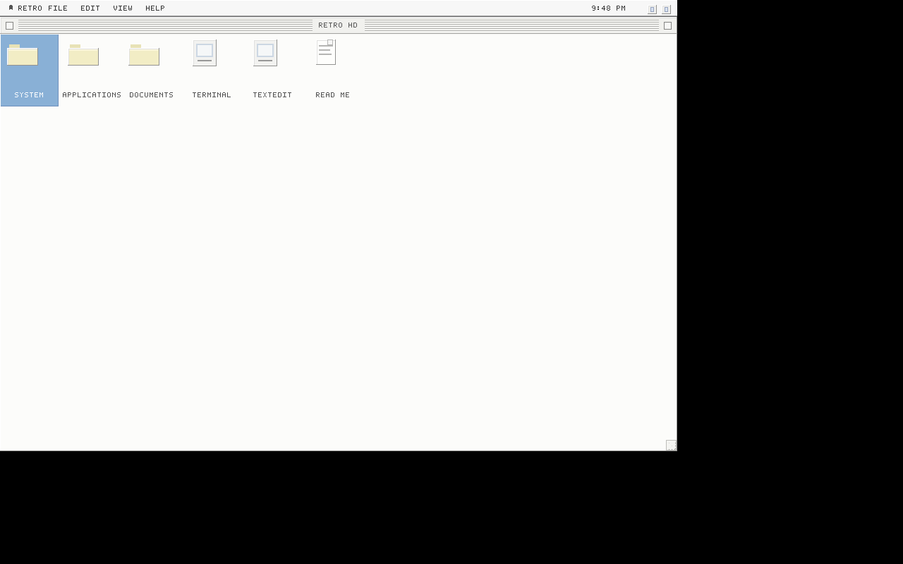

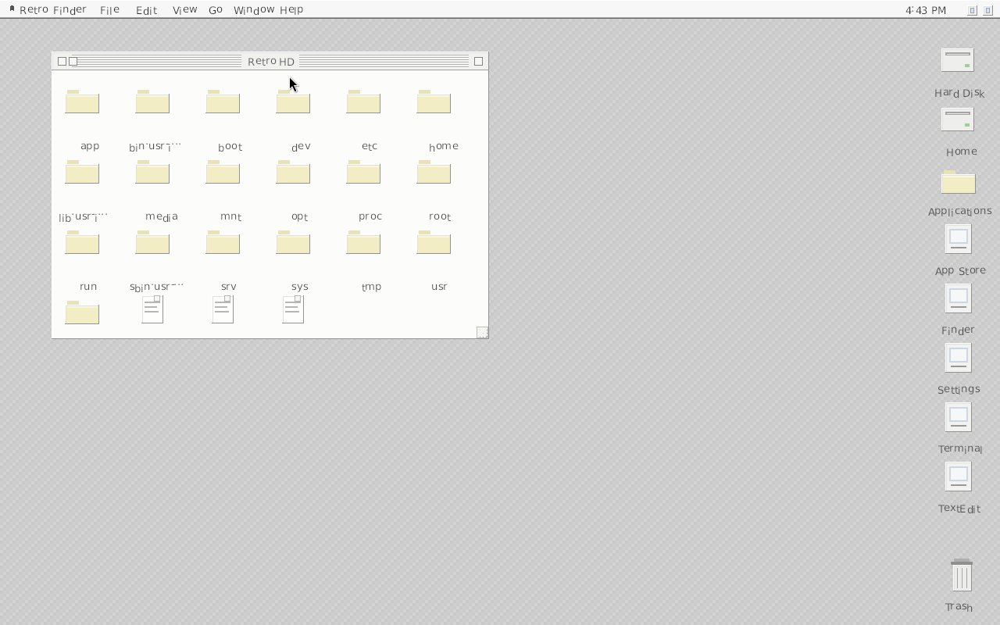

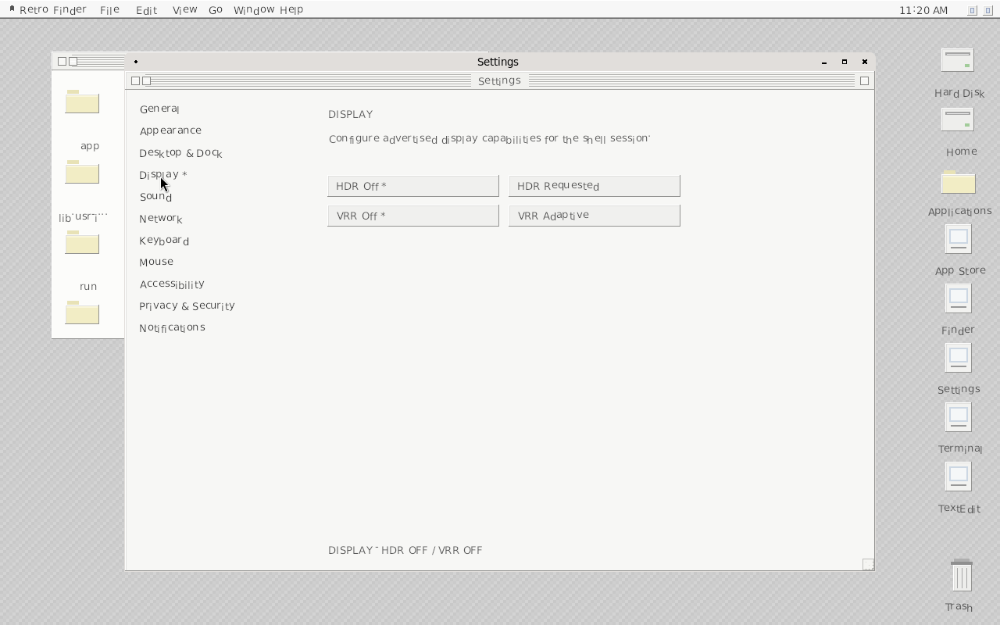

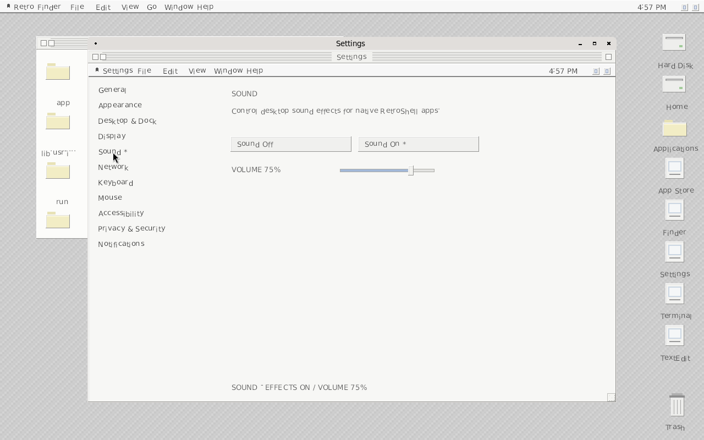

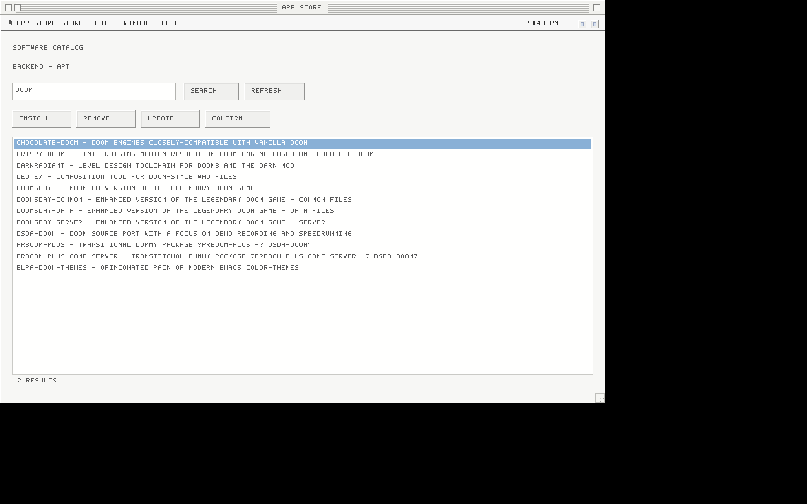

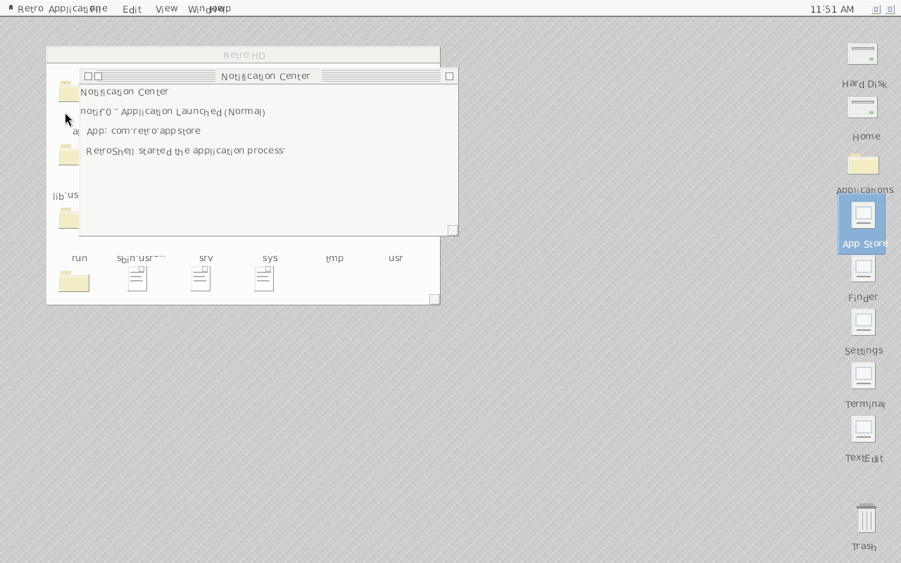

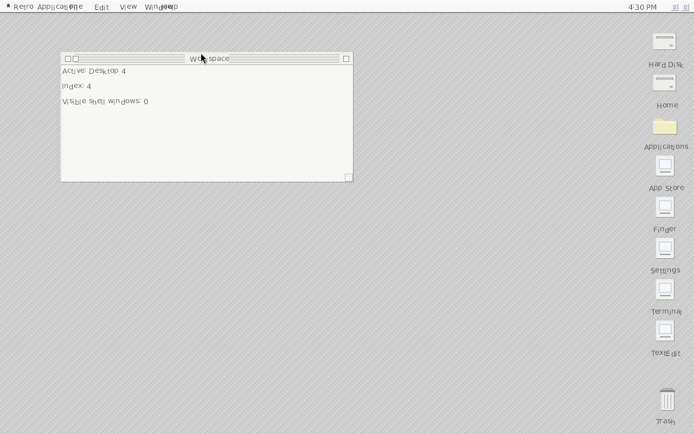

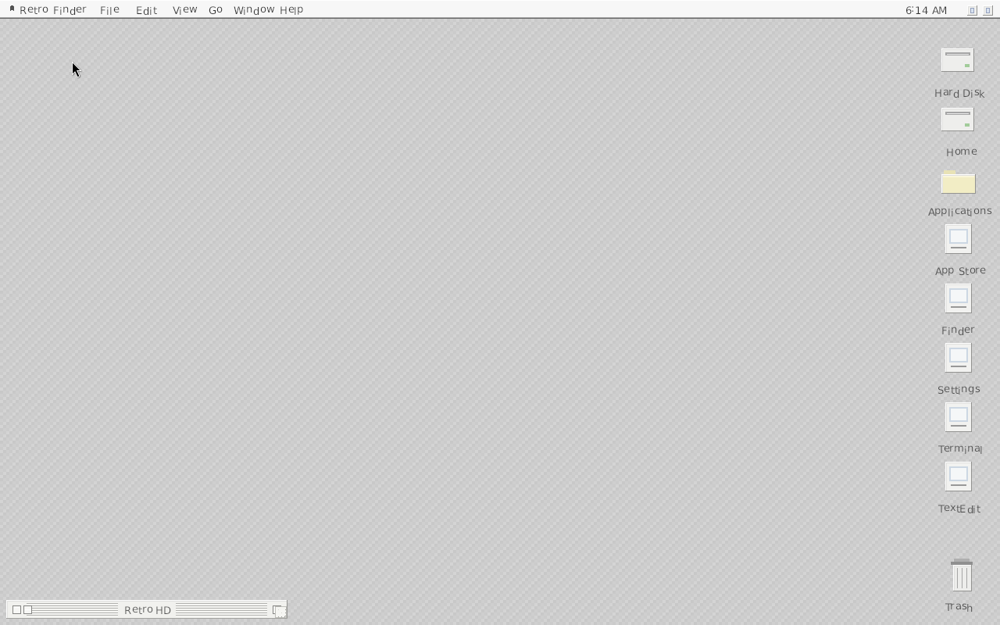

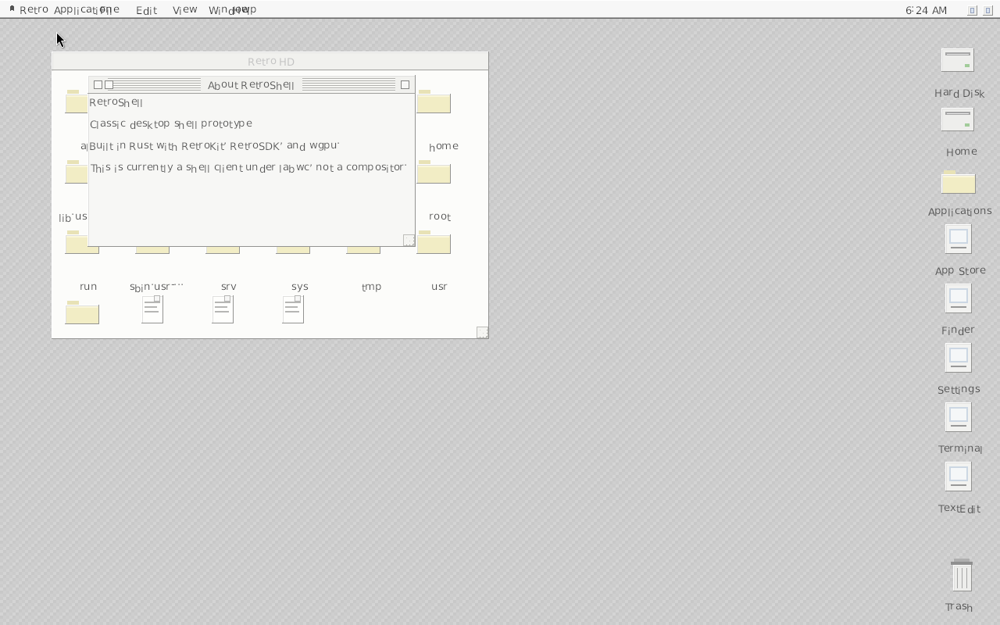

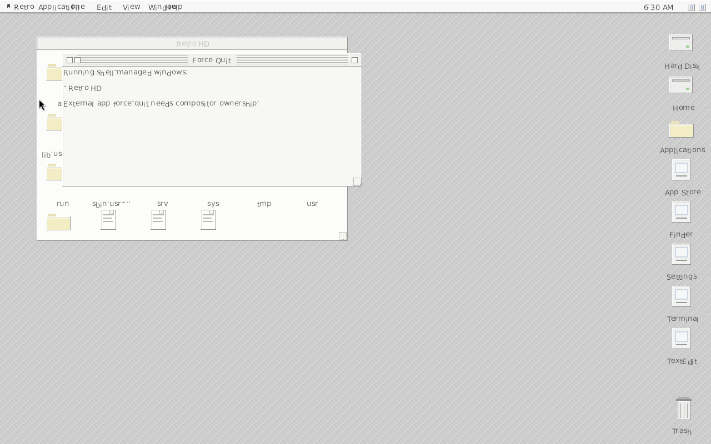

## Raspberry Pi / native Linux verification

On a Pi or Linux box with GPU/Wayland deps:

```bash
chmod +x scripts/verify_pi.sh
./scripts/verify_pi.sh
```

The script installs build deps (apt), runs `cargo test --workspace`, builds release
binaries, and probes NetworkManager, audio, UPower, DRI, and AT-SPI. Compositor
runtime is smoke-tested when `DISPLAY` or `WAYLAND_DISPLAY` is set.

Docker (macOS host visual QA):

```bash
docker build -t retroshell .
docker run -d --name rs -p 6080:6080 retroshell
# open http://localhost:6080/vnc.html
# Default lock password in image: retroshell (RETROSHELL_LOCK_PASSWORD)
```

If `retro-compositor` fails with missing DRI3 under nested Xvfb, the entrypoint
falls back to labwc and still launches the full DE. Check `/tmp/retro-compositor.log`
inside the container.
