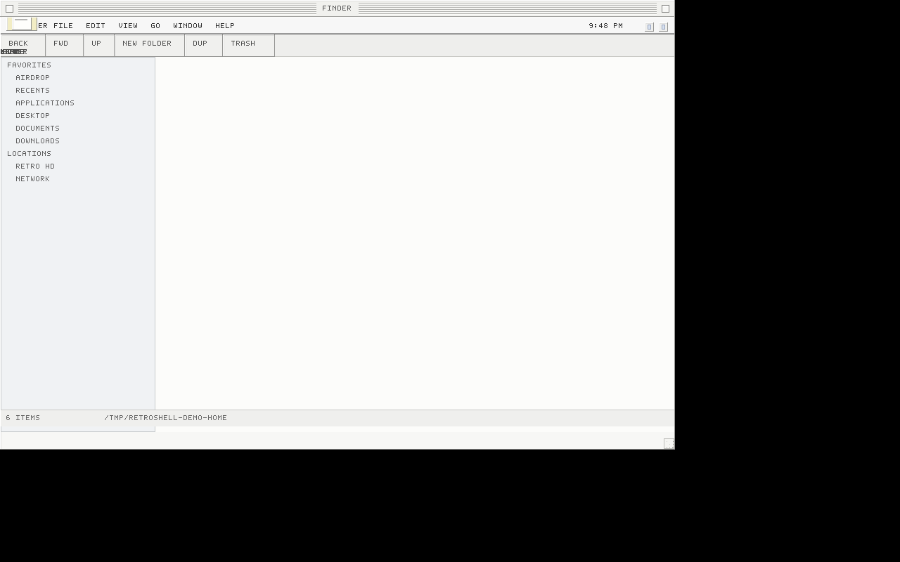
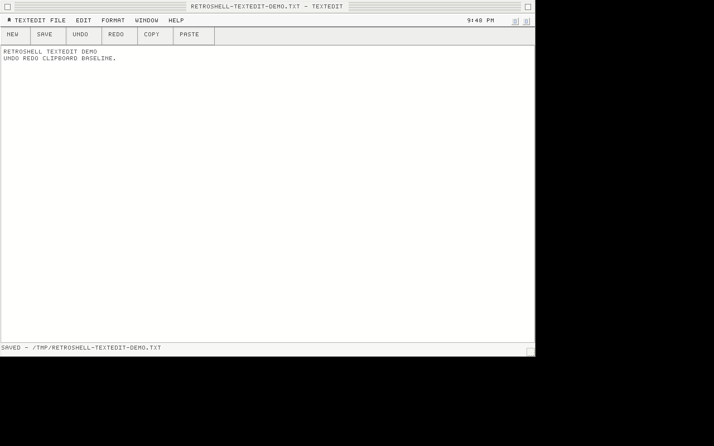
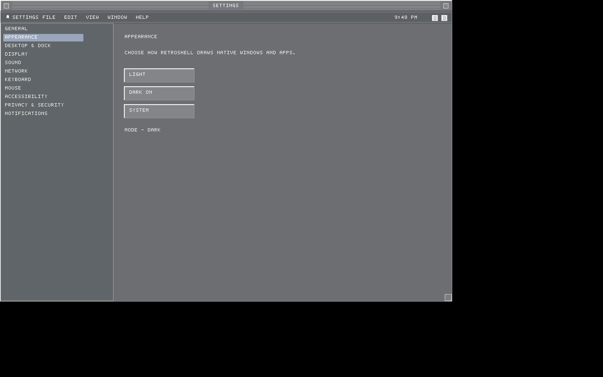
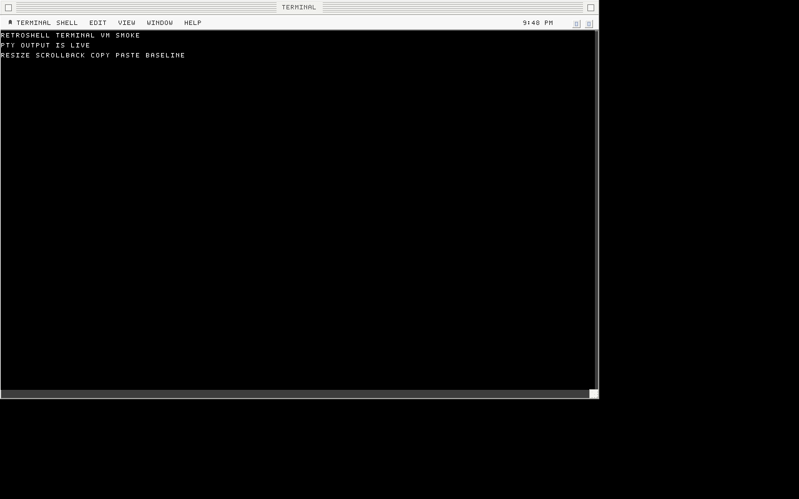

# RetroShell

A native Rust desktop environment experiment inspired by Classic Mac OS, NeXTSTEP, and BeOS.

RetroShell is made from:

- `retro-shell`: desktop runtime shell services
- `retro-kit`: native UI toolkit
- `retro-render`: `wgpu` rendering layer
- `retro-sdk`: first-party app runtime
- `retro-bus`: IPC foundation

See [docs/README.md](docs/README.md) for larger architecture notes.

## Screenshots

Every major UI/UX change should refresh current screenshots. Screenshots live in [docs/screenshots](docs/screenshots/).

### Current Implementation

Captured from a Linux VM/Xvfb/Mesa smoke run after the native `wgpu` desktop filled a 1280x800 surface, accepted menu and pointer interaction, rendered original desktop icons, opened managed Finder-style shell windows, opened desktop folders into filesystem-backed shell windows, opened child folder windows from managed shell windows, raised/focused windows, closed active windows, used titlebar close/zoom controls, toggled fullscreen through the View menu, dragged/resized windows, and rendered the grow box.

### Finder

Captured from a Linux VM/Xvfb smoke run against a demo home directory after Finder rendered status/path display, sorted directory contents, folder entry, visible Back/Forward/Up controls, visible New Folder/Duplicate/Trash controls, navigation history, and New Folder from the toolbar.

### TextEdit

Captured from a Linux VM/Xvfb smoke run after TextEdit opened a real document path, rendered editable document text, exposed New/Save/Undo/Redo/Copy/Paste actions, and showed saved/path status.

### Settings

Captured from a Linux VM/Xvfb smoke run after Settings clicked the Dark appearance control, persisted `appearance=dark`, and refreshed the selected mode/status UI.

### Native Dark Mode

Captured from a Linux VM/Xvfb smoke run after the SDK read `appearance=dark` from `settings.conf` and rendered Settings with dark window chrome, menus, controls, lists, and text surfaces.

### Terminal

Captured from a Linux VM/Xvfb smoke run after Terminal launched a real PTY-backed shell script, consumed asynchronous output, repainted the native terminal surface, and rendered the live output.

### App Store

Captured from a Linux VM/Xvfb smoke run after App Store detected the host `APT` backend, ran a real package-manager search for `doom`, and rendered package results.

## Current State

RetroShell currently builds and launches a native rendered desktop surface, menu strip, desktop icons, app bundle labels, first-party apps wired through RetroKit/RetroSDK, and first-pass managed shell windows with close, zoom, fullscreen, drag, and resize behavior. Desktop Home/Hard Disk/Trash icons open folder-backed shell windows, and folder icons inside managed shell windows open child folder windows.

Finder has directory listing, folder entry, visible navigation controls, parent navigation, back/forward history, file-operation toolbar controls, New Folder/Duplicate/Trash helpers, and VM-smoked path/status display.

TextEdit opens an optional document path passed on the command line, edits through a native multiline text field, saves back to disk, supports Cmd-N/Cmd-S, supports Cmd-Z/Shift-Cmd-Z undo/redo, exposes baseline whole-document copy/cut/paste/select-all shortcuts, and shows toolbar actions for New/Save/Undo/Redo/Copy/Paste.

Settings loads and saves `settings.conf` under `RETROSHELL_CONFIG_DIR` or `~/.config/retroshell`, exposes Light/Dark/System controls, persists changes immediately, and reports the active mode. The SDK consumes that same preference and renders shared native chrome/controls with a dark appearance when `appearance=dark`.

Terminal launches a real PTY, propagates layout resize to the terminal grid and PTY, consumes async PTY output with runtime repaint, supports scrollback navigation, and wires Cmd-C/Cmd-V to the in-process clipboard baseline.

App Store launches as a first-party app, detects Linux/BSD package managers, and runs read-only package searches through the detected backend. Install/remove/update transactions and privilege handling remain future work.

This is still foundation work, not a polished full desktop environment.

## Recent Verification

- `cargo fmt --all -- --check`
- `cargo check --workspace --all-targets`
- `cargo test --workspace -q` (65 tests)
- `cargo clippy --workspace --all-targets -- -D warnings`
- Linux VM/Xvfb/Mesa smoke: `retro-shell` starts at 1280x800 and captures `docs/screenshots/current-retroshell-desktop.png`.
- Linux VM/Xvfb/Mesa smoke: `finder` starts against a demo home directory, creates New Folder from the toolbar, refreshes path/status display, and captures `docs/screenshots/current-finder.png`.
- Linux VM/Xvfb/Mesa smoke: `textedit` opens a document path, renders edit controls, and captures `docs/screenshots/current-textedit.png`.
- Linux VM/Xvfb/Mesa smoke: `settings` clicks Dark appearance, verifies `appearance=dark`, and captures `docs/screenshots/current-settings.png`.
- Linux VM/Xvfb/Mesa smoke: `settings` launches with `appearance=dark`, renders dark native chrome/controls, and captures `docs/screenshots/current-dark-mode-settings.png`.
- Linux VM/Xvfb/Mesa smoke: `terminal` launches a PTY-backed shell script, renders live output, and captures `docs/screenshots/current-terminal.png`.
- Linux VM/Xvfb/Mesa smoke: `appstore` detects APT, searches for `doom`, renders package-manager results, and captures `docs/screenshots/current-appstore.png`.

## Visual Direction

Current visual direction: Classic Mac-inspired desktop proportions, menu density, icon treatment, window chrome, and calm gray desktop texture. Do not commit or ship Apple-owned marks, logos, icons, or copied bitmap assets.

## What Is Left

Plenty. The next major work is closing the gap between the current functional prototype and the full desktop environment target.

- Window management: focus rings, minimize controls, modal dialogs, persisted placement, external app surfaces.
- Finder desktop: contextual menus, drag/drop, trash UI polish, desktop integration, polished multi-window workflows.
- Dock/application launching: running indicators, focus, lifecycle integration, folders, trash.
- Native dark mode: complete theme-token coverage, live switching from Settings, dark assets/icons, contrast validation.
- Text rendering: proper `cosmic-text` rendering, font metrics, clipping, invalidation, visual regression screenshots.
- App completeness: Finder, Settings, TextEdit, Terminal, package-manager backed App Store need real workflows.
- Platform integration: Wayland-first shell behavior, input methods, clipboard, accessibility, multi-monitor, HiDPI, packaging, startup sessions.
- Display goals: compositor/session path, HDR metadata/color pipeline, VRR frame pacing.
- Release evidence: video with audio of Doom running on RetroShell in windowed, borderless fullscreen, and exclusive fullscreen modes.
